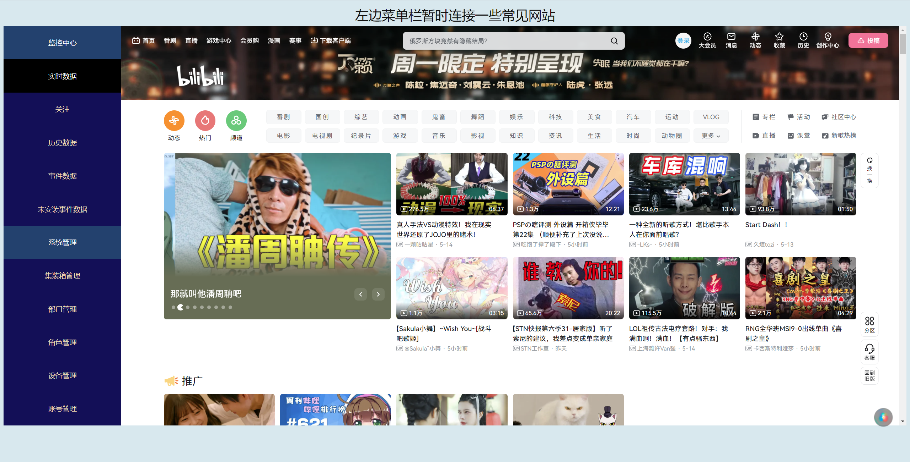

# <center>导航栏制作（实践flex布局和scss）

### scss设计：
```scss
body{
    background-color: rgb(214, 232, 239);
    display: flex;
    flex-direction:column;
   
}
.topbar {
    height: 50px; 
    width: 100%;
    background-color: rgb(214, 232, 239);
    display: flex;
    flex-direction: column;
    justify-content: space-around;
    p{
        line-height: 15px;
        margin: auto;
        font-size: 30px;
        color: rgb(18, 18, 17);;
     }

}

.sorce {
    height: 900px;
    width: 100%;
    background-color: rgb(250, 239, 239);
    display: flex;
    .navigation  {
   
        width: 15% ;
        background-color: rgb(26, 64, 112);
        display: flex;
        flex-direction: column;
        justify-content: space-around;
        a{
            text-decoration: none;
        }
        a:hover{
            color: rgb(53, 210, 119);
        }
        a:visited {
            color:blue;
        }
        a1{
            text-decoration: none;
            color: rgb(254, 254, 254);
            text-align: center;
            line-height: 20px; 
            margin-top: 0px;
            flex: 1;
            display: flex;
            align-items: center;
            justify-content: center;
        }
    }
    .neiron {
        width: 100%;
    
    }
    .daohang{
        background-color: rgb(15, 10, 90);
        line-height: 20px; 
        margin-top: 0px;
        text-align: center;
        color: wheat;
        flex: 1;
        display: flex;
        align-items: center;
        justify-content: center;
    }
}

```
### html
- 还未来得及使用小图标
- 为了测试出点击的实现，菜单栏链接几个常见网站
- js代码放在html中，用作点击事件后的显示的变化，但是比较低效（时间复杂度O（n））
```html
<!DOCTYPE html>
<html lang="en">

<head>
  <meta charset="UTF-8" />
  <meta name="viewport" content="width=device-width, initial-scale=1.0" />
  <title>Document</title>
  <link rel="stylesheet" type="text/css" href="./menu.css" />
</head>

<body>

  <div class="topbar">
    <p>左边菜单栏暂时连接一些常见网站</p>
  </div>

  <div class="sorce">
    <div class="navigation">
      <a1>监控中心</a1>
      <a href="https://www.bilibili.com/" class="daohang" target="d" onclick="changeColor(this)">实时数据</a>
      <a href="http://www.kugou.com/" class="daohang" target="d" onclick="changeColor(this)">关注</a>
      <a href="https://y.qq.com/?ADTAG=myqq#type=index" class="daohang" target="d" onclick="changeColor(this)">历史数据</a>
      <a href="https://music.migu.cn/v3" class="daohang" target="d" onclick="changeColor(this)">事件数据</a>
      <a href="https://www.youku.com/" class="daohang" target="d" onclick="changeColor(this)">未安装事件数据</a>
      <a1>系统管理</a1>
      <a href="https://v.qq.com/" class="daohang" target="d" onclick="changeColor(this)">集装箱管理</a>
      <a href="https://www.iqiyi.com/" class="daohang" target="d" onclick="changeColor(this)">部门管理</a>
      <a href="https://github.com/" class="daohang" target="d" onclick="changeColor(this)">角色管理</a>
      <a href="https://www.acfun.cn/" class="daohang" target="d" onclick="changeColor(this)">设备管理</a>
      <a href="https://leetcode-cn.com/" class="daohang" target="d" onclick="changeColor(this)">账号管理</a>
    </div>

    <iframe name="d" class="neiron" frameborder="0"></iframe>
    <script type="text/javascript">
      function changeColor(obj) {
        allObj = document.getElementsByClassName("daohang");
        for (var i = 0; i < allObj.length; i++) {
          allObj[i].style.background = 'rgb(15, 10, 90)';
          allObj[i].style.color = 'wheat';
        }
        obj.style.background = 'black';
        obj.style.color = 'white';
      }	
    </script>
  </div>
</body>

</html>
```

### 运行展示


